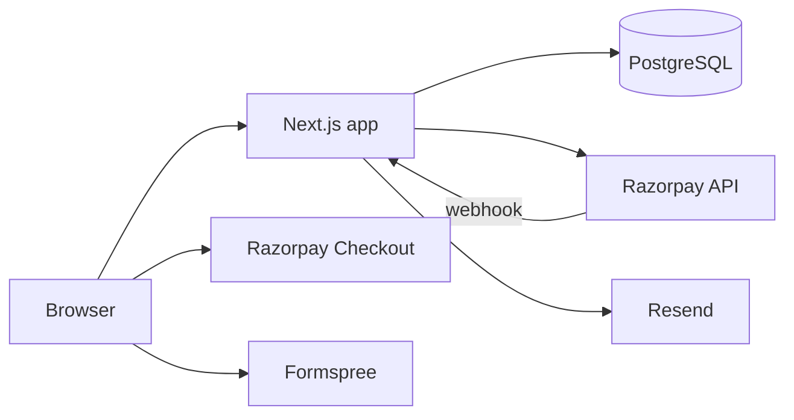
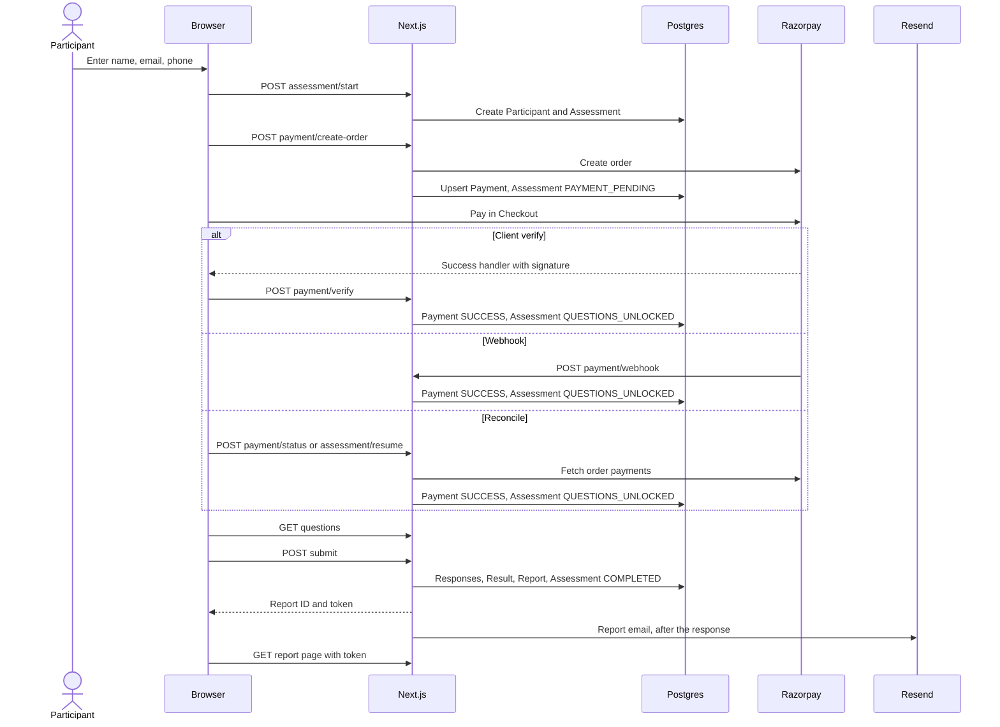

# Architecture

**Audience:** developer

PsychoMetric Pro is a single Next.js 16 App Router application. Pages and API route handlers run in the same deployment and share one PostgreSQL database. There is no separate backend, queue or cache service.

## Contents

- [System overview](#system-overview)
- [Participant flow](#participant-flow)
- [Pages](#pages)
- [Module map](#module-map)
- [Background work](#background-work)
- [Key design decisions](#key-design-decisions)
- [Request lifecycle](#request-lifecycle)

## System overview

| External service | Used for | Called from |
|---|---|---|
| PostgreSQL | All persistent data | Server, through `src/lib/db.ts` |
| Razorpay API | Create orders, list an order's payments | Server, through `src/lib/razorpay.ts` |
| Razorpay Checkout | Payment UI (`checkout.razorpay.com/v1/checkout.js`) | Browser, on `/assessment` |
| Razorpay webhooks | Payment events | Razorpay to `/api/payment/webhook` |
| Resend | Report and recovery emails | Server, through `src/lib/email.ts` |
| Formspree | Contact form in the site footer | Browser, directly (`src/app/site-footer.tsx`). The app stores nothing from it. |

## Participant flow

The three confirmation paths are not exclusive. Usually client verify and the webhook both arrive, and whichever is second does nothing. Details and guarantees are in [PAYMENTS.md](PAYMENTS.md#confirmation-paths).

## Pages

| Path | File | Access | Purpose |
|---|---|---|---|
| `/` | `src/app/page.tsx` | Public | Landing page with the configured price and the contact form |
| `/assessment` | `src/app/assessment/page.tsx` | Public | Registration form, Razorpay Checkout, and payment status polling |
| `/assessment/resume` | `src/app/assessment/resume/page.tsx` | Public | Request a recovery email |
| `/assessment/<ASSESSMENT_ID>/questions` | `src/app/assessment/[token]/questions/page.tsx` | Assessment ID | Answer the 50 questions one at a time, review, submit |
| `/report/<REPORT_ID>?t=<TOKEN>` | `src/app/report/[id]/page.tsx` | Report token | The report, with PDF download links that carry the token |
| `/admin/login` | `src/app/admin/login/page.tsx` | Public | Admin sign-in |
| `/admin` | `src/app/admin/page.tsx` | Admin | Dashboard |
| `/admin/participants` | `src/app/admin/participants/page.tsx` | Admin | Participant list and orphan cleanup |
| `/admin/participants/<ID>` | `src/app/admin/participants/[id]/page.tsx` | Admin | One participant, with report access controls |
| `/admin/payments` | `src/app/admin/payments/page.tsx` | Admin | Successful payments |
| `/admin/reports` | `src/app/admin/reports/page.tsx` | Admin | Report list |
| `/admin/responses` | `src/app/admin/responses/page.tsx` | Admin | "User Input Analysis": answer distributions and quality flags |
| `/admin/evidence` | `src/app/admin/evidence/page.tsx` | Admin | Project metrics, CSV export and reset |
| `/admin/audit` | `src/app/admin/audit/page.tsx` | Admin | Latest 100 audit log entries |

Each admin page is described for admins in [ADMIN_GUIDE.md](ADMIN_GUIDE.md).

## Module map

| Module | Responsibility | Used by |
|---|---|---|
| `src/lib/config.ts` | Zod-validated email and pricing settings | `email.ts`, `razorpay.ts`, the landing page, `/admin/evidence`, `src/app/assessment/actions.ts` |
| `src/lib/db.ts` | Single Prisma client with the pg adapter | Every module that reads or writes data |
| `src/lib/auth.ts` | Create, verify and clear the admin session; `requireAdmin()` | `src/proxy.ts`, admin routes, the PDF route |
| `src/lib/audit.ts` | `logAdminAction()`: writes `AuditLog` in `after()` | Admin routes |
| `src/lib/rate-limit.ts` | Sliding-window limiter on `RateLimitHit` | Start, create-order, status, resume, admin login |
| `src/lib/client-ip.ts` | Client IP for rate-limit keys | Same as above |
| `src/lib/razorpay.ts` | Razorpay client, price constants, checkout signature check | Create-order, verify, `payments/reconcile.ts` |
| `src/lib/payments/unlock.ts` | `markPaymentSucceeded`, `markPaymentFailed` | Verify, webhook, `payments/reconcile.ts` |
| `src/lib/payments/reconcile.ts` | `reconcileAssessment()` against the Razorpay API | Status, resume, admin reconcile |
| `src/lib/report-token.ts` | Token generation, hashing, expiry, `checkReportAccess`, `reissueReportToken` | Submit, report API and PDF routes, report page, issue-token, resume, resend-email |
| `src/lib/email.ts` | `sendReportEmail()`: `EmailLog`, Resend send with retries, `Report.emailSentAt` | Submit, resume, resend-email |
| `src/lib/email/templates.ts` | `getReportEmailHtml()`, the only email template | `email.ts` |
| `src/lib/scoring/engine.ts` | `scoreAssessment()`: answers to 0-100 trait scores | Submit |
| `src/lib/scoring/interpret.ts` | `interpretScores()` builds the report; `deriveResponseQuality()` | Submit, `/admin/responses` |
| `src/lib/scoring/analytics.ts` | Per-question answer statistics | `/admin/responses` |
| `src/lib/pdf/ReportDocument.tsx` | React-PDF template and `PDF_TEMPLATE_VERSION` | PDF route, regen-pdf |
| `src/lib/admin/metrics.ts` | Dashboard metrics and reset preview counts | Admin pages, CSV export |
| `src/lib/admin/currency.ts` | Paise to rupee conversion and formatting | `metrics.ts` |
| `src/lib/utils/date.ts` | Date formatting in IST | Admin pages, report page, PDF |

Outside `src/lib`: `src/data/questions.ts` holds the 50 questions and their scoring keys, and `src/types/index.ts` holds the shared types, including `ReportData`.

## Background work

`after()` from `next/server` runs a callback after the response has been sent. It is used in four places:

| Location | Work | On failure |
|---|---|---|
| `src/lib/email.ts` | Create `EmailLog`, send through Resend with up to 3 attempts (waits of 2 s then 4 s), mark the log `SENT` or `FAILED`, set `Report.emailSentAt` | Logged as `[email]`; the log row is `FAILED` |
| `src/lib/audit.ts` | Insert the `AuditLog` row | Logged as `[audit]`; the entry is lost |
| `src/app/api/assessment/[token]/submit/route.ts` | Request the new report's PDF so it is cached before the participant clicks | Logged to the console |
| `src/app/api/report/[id]/pdf/route.ts` | Upsert the freshly rendered PDF into `ReportPdf` | Logged as `[pdf]`; the next download renders again |

There are no cron jobs and no queue. The only scheduled cleanup is the probabilistic `RateLimitHit` purge in `rate-limit.ts`.

## Key design decisions

### Sequential writes instead of transactions

**Decision.** Multi-row writes are separate awaited calls, not `db.$transaction`.

**Why.** The code comments state that the Prisma 7 driver adapter used here does not support interactive transactions (error P2028).

**How it stays safe.** Each sequence is ordered and guarded so that a retry finishes the job instead of duplicating it:

| Sequence | Guard |
|---|---|
| Payment unlock | The payment is written before the assessment. A second confirmation returns early once the payment is `SUCCESS`, so the unlock happens at most once. |
| Submit answers | `Response` has a unique `(assessmentId, questionId)` and uses `skipDuplicates`. `Result` and `Report` have unique `assessmentId`. |
| Webhook | `WebhookEvent.eventId` is unique; `processedAt` is set last. |
| Reset and cleanup | Children are deleted before parents, matching the `RESTRICT` foreign keys. |

Known limits: if the server stops between the payment write and the assessment write, `markPaymentSucceeded` returns early on retry, so the assessment stays locked until an admin fixes it by hand. If submission stops after `Result` is written, a retry fails on the unique constraint. If registration stops after the participant is written, the participant is an orphan until [orphan cleanup](DATABASE.md#orphan-cleanup).

### Postgres-backed rate limiter

**Decision.** Rate limits are counted in a `RateLimitHit` table.

**Why.** Serverless instances share no memory, so an in-memory counter would be per instance. A table works across instances without adding Redis or another service.

**Cost.** Two or three queries per limited request. Old rows are purged on about 1% of calls.

### Report tokens hashed at rest

**Decision.** A report link carries a random 32-byte token. Only its SHA-256 hash is stored.

**Why.** A database leak does not reveal working report links. Comparison is constant-time.

**Cost.** The raw token cannot be recovered. Any flow that needs to send a link again (resume, resend email, issue token) creates a new token, and the old link stops working.

### PDF cache keyed by content hash

**Decision.** Rendered PDFs are stored in `ReportPdf` with a hash of the report content plus `PDF_TEMPLATE_VERSION`.

**Why.** Rendering with React-PDF is slow. The hash means a cached PDF is used only if both the content and the template version still match. Changing `PDF_TEMPLATE_VERSION` in `src/lib/pdf/ReportDocument.tsx` makes every cached PDF stale, and each is re-rendered on its next download.

### after() for background work

**Decision.** Email, audit writes and PDF caching run in `after()`.

**Why.** The participant does not wait for Resend or PDF rendering, and a failure there cannot fail the request that triggered it.

**Cost.** Failures are only logged. There is no retry beyond the email's three attempts, and a failed audit write is lost.

### One admin, configured by environment variables

**Decision.** There is no admin user table. `ADMIN_EMAIL` and `ADMIN_PASSWORD_HASH` define one admin, and the session is a signed cookie with no server-side store.

**Why.** It removes account management, sign-up and password reset from the attack surface.

**Cost.** The audit log cannot say which person acted. A single session cannot be revoked; rotating `ADMIN_SESSION_SECRET` signs out every session. See [SECURITY.md](SECURITY.md#secret-rotation).

## Request lifecycle

1. **Headers.** `next.config.ts` adds `X-Content-Type-Options`, `X-Frame-Options: SAMEORIGIN`, `Referrer-Policy`, `Permissions-Policy` and `X-DNS-Prefetch-Control` to every response.
2. **Proxy.** `src/proxy.ts` runs on every request:
   - `/admin/*` except `/admin/login`: without a valid session, redirect to `/admin/login`.
   - `/api/admin/*` except `/api/admin/login` and `/api/admin/logout`: without a valid session, return plain-text `401 Unauthorized`.
   - Everything else passes through.
3. **Session check.** `verifySession()` in `src/lib/auth.ts` parses `admin.<issuedAt>.<signature>`, recomputes `HMAC-SHA256("admin.<issuedAt>", ADMIN_SESSION_SECRET)`, compares in constant time, and rejects a session older than 24 hours. Any exception, including a missing secret, rejects it.
4. **Handler check.** Admin API handlers check the session again:

   | Handler | Check |
   |---|---|
   | `reports/[id]/*`, `participants/cleanup`, the PDF route | `requireAdmin()` |
   | `reset` | Its own `getAdminSession()`, same logic |
   | `payments/reconcile` | Inline cookie read and `verifySession()` |
   | `evidence/export` | None; relies on the proxy |

   Admin pages are server components and rely on the proxy alone.
5. **Validation.** Participant-facing handlers validate bodies with Zod before touching the database.
