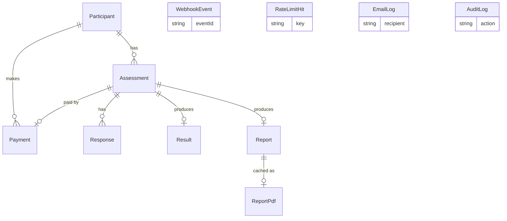

# Database

**Audience:** developer

PostgreSQL, accessed through Prisma 7 with the `@prisma/adapter-pg` driver adapter. The schema is `prisma/schema.prisma`. The client is created once in `src/lib/db.ts`.

## Contents

- [Entity relationship diagram](#entity-relationship-diagram)
- [Units and conventions](#units-and-conventions)
- [Enums](#enums)
- [Models](#models)
- [Migration history](#migration-history)
- [Retention and deletion](#retention-and-deletion)
- [Backup and restore](#backup-and-restore)

## Entity relationship diagram

`WebhookEvent`, `RateLimitHit`, `EmailLog` and `AuditLog` have no relations to other tables.

## Units and conventions

| Convention | Detail |
|---|---|
| Money | `Payment.amount` is an integer in **paise**. ₹99 is stored as 9900 (9900 paise). Conversion to rupees happens only at display time, in `src/lib/admin/currency.ts`. |
| Trait scores | `Result` columns are floats from 0 to 100. See [SCORING.md](SCORING.md). |
| Timestamps | `DateTime` columns are stored in UTC. The admin UI formats them in IST (`src/lib/utils/date.ts`). |
| IDs | `Assessment.id` is a UUID, because it appears in participant URLs and Zod validates it with `.uuid()`. Every other model uses a CUID. |
| Foreign keys | All are `ON DELETE RESTRICT` except `ReportPdf.reportId`, which is `ON DELETE CASCADE`. Deleting a parent row fails while children exist, so deletion code removes children first. |

## Enums

| Enum | Values | Used by |
|---|---|---|
| `AssessmentStatus` | `CREATED`, `PAYMENT_PENDING`, `PAYMENT_FAILED`, `QUESTIONS_UNLOCKED`, `COMPLETED` | `Assessment.status` |
| `PaymentStatus` | `CREATED`, `PENDING`, `SUCCESS`, `FAILED` | `Payment.status`. No code path writes `PENDING`. It is only read. |
| `ConfirmedVia` | `client_verify`, `webhook`, `reconcile` | `Payment.confirmedVia` |
| `EmailStatus` | `PENDING`, `SENT`, `FAILED` | `EmailLog.status` |

Status transitions are documented in [PAYMENTS.md](PAYMENTS.md#status-machines).

## Models

### Participant

One row per registration. The same email can register more than once, and each registration creates a new participant.

| Field | Type | Null | Default | Meaning |
|---|---|---|---|---|
| `id` | String | No | `cuid()` | Primary key |
| `name` | String | No | | Trimmed, 2 to 100 characters |
| `email` | String | No | | Trimmed and lowercased, up to 200 characters |
| `phone` | String | No | | Matches `^\+?[0-9\s\-()]{7,20}$` |
| `createdAt` | DateTime | No | `now()` | Registration time |

Indexes: `email`. Written by `POST /api/assessment/start`. Deleted by orphan cleanup and reset.

### Assessment

One attempt at the questionnaire. Its `id` is the **assessment ID**, used in `/assessment/<ID>/questions`.

| Field | Type | Null | Default | Meaning |
|---|---|---|---|---|
| `id` | String | No | `uuid()` | Primary key (assessment ID) |
| `participantId` | String | No | | FK to `Participant` |
| `status` | AssessmentStatus | No | `CREATED` | Lifecycle state |
| `startedAt` | DateTime | No | `now()` | Creation time |
| `completedAt` | DateTime | Yes | | Set on submission |

Indexes: `participantId`. Written by start, create-order, `markPaymentSucceeded`, `markPaymentFailed` and submit.

### Response

One answer to one question.

| Field | Type | Null | Default | Meaning |
|---|---|---|---|---|
| `id` | String | No | `cuid()` | Primary key |
| `assessmentId` | String | No | | FK to `Assessment` |
| `questionId` | String | No | | Question ID such as `O1` or `N10` from `src/data/questions.ts` |
| `answer` | Int | No | | 1 to 5 |

Constraints: unique `(assessmentId, questionId)`. Index: `assessmentId`. Written by submit with `createMany({ skipDuplicates: true })`.

### Payment

One Razorpay order per assessment. Re-ordering updates the same row.

| Field | Type | Null | Default | Meaning |
|---|---|---|---|---|
| `id` | String | No | `cuid()` | Primary key |
| `participantId` | String | No | | FK to `Participant` |
| `assessmentId` | String | No | | FK to `Assessment`, unique |
| `razorpayOrderId` | String | No | | Razorpay order ID, unique |
| `razorpayPaymentId` | String | Yes | | Razorpay payment ID once captured, unique |
| `amount` | Int | No | | Price in paise at order time |
| `currency` | String | No | `"INR"` | Currency at order time |
| `status` | PaymentStatus | No | `CREATED` | Payment state |
| `confirmedVia` | ConfirmedVia | Yes | | Which path marked it `SUCCESS` |
| `paidAt` | DateTime | Yes | | When it was marked `SUCCESS` |
| `createdAt` | DateTime | No | `now()` | |
| `updatedAt` | DateTime | No | `@updatedAt` | |

Constraints: unique `assessmentId`, unique `razorpayOrderId`, unique `razorpayPaymentId`. Index: `razorpayOrderId`. Written by create-order (upsert) and by `src/lib/payments/unlock.ts`.

### WebhookEvent

Idempotency ledger for Razorpay webhooks.

| Field | Type | Null | Default | Meaning |
|---|---|---|---|---|
| `id` | String | No | `cuid()` | Primary key |
| `eventId` | String | No | | `x-razorpay-event-id` header, unique |
| `event` | String | No | | Event name, for example `payment.captured` |
| `receivedAt` | DateTime | No | `now()` | First receipt |
| `processedAt` | DateTime | Yes | | Set when processing succeeds |
| `error` | String | Yes | | Last processing error, cleared on success |

Written only by `POST /api/payment/webhook`.

### Result

Numeric trait scores for a completed assessment.

| Field | Type | Null | Default | Meaning |
|---|---|---|---|---|
| `id` | String | No | `cuid()` | Primary key |
| `assessmentId` | String | No | | FK to `Assessment`, unique |
| `openness`, `conscientiousness`, `extraversion`, `agreeableness`, `neuroticism` | Float | No | | Score 0 to 100 |
| `createdAt` | DateTime | No | `now()` | |

Written by submit.

### Report

The generated report. Its `id` is the **report ID**.

| Field | Type | Null | Default | Meaning |
|---|---|---|---|---|
| `id` | String | No | `cuid()` | Primary key (report ID) |
| `assessmentId` | String | No | | FK to `Assessment`, unique |
| `content` | Json | No | | Full report (`ReportData` in `src/types/index.ts`), including the participant's name |
| `accessTokenHash` | String | Yes | | SHA-256 hex of the report link token. Null means a legacy report. |
| `accessTokenCreatedAt` | DateTime | Yes | | When the current token was issued |
| `expiresAt` | DateTime | Yes | | When the report link stops working |
| `revokedAt` | DateTime | Yes | | Set by the admin **Revoke** action |
| `emailSentAt` | DateTime | Yes | | Set after a report email is sent successfully |
| `createdAt` | DateTime | No | `now()` | |

Written by submit, the admin report actions and `sendReportEmail`. Token fields are also rewritten by `reissueReportToken` in `src/lib/report-token.ts`.

### ReportPdf

Cached PDF bytes for a report.

| Field | Type | Null | Default | Meaning |
|---|---|---|---|---|
| `reportId` | String | No | | Primary key and FK to `Report`, `ON DELETE CASCADE` |
| `bytes` | Bytes | No | | PDF file |
| `contentHash` | String | No | | SHA-256 of `JSON.stringify(content) + PDF_TEMPLATE_VERSION` |
| `createdAt` | DateTime | No | `now()` | Reset on every regeneration |

Written by the PDF route (in `after()`) and the admin **Regen PDF** action. Deleted by **Clear PDF Cache**, orphan cleanup and reset.

### RateLimitHit

One row per allowed request against a rate-limited key.

| Field | Type | Null | Default | Meaning |
|---|---|---|---|---|
| `id` | String | No | `cuid()` | Primary key |
| `key` | String | No | | For example `login:ip:<IP>` |
| `createdAt` | DateTime | No | `now()` | Hit time |

Index: `(key, createdAt)`. Written by `src/lib/rate-limit.ts`. About 1% of calls also delete rows older than 24 hours.

### EmailLog

One row per report email attempt.

| Field | Type | Null | Default | Meaning |
|---|---|---|---|---|
| `id` | String | No | `cuid()` | Primary key |
| `recipient` | String | No | | Participant email |
| `subject` | String | No | | Always `Your Personality Assessment Report is Ready` |
| `status` | EmailStatus | No | `PENDING` | Outcome |
| `error` | String | Yes | | Last error, truncated to 255 characters |
| `createdAt` | DateTime | No | `now()` | |
| `sentAt` | DateTime | Yes | | Set on success |

Written by `src/lib/email.ts`. No page displays it.

### AuditLog

Record of admin actions.

| Field | Type | Null | Default | Meaning |
|---|---|---|---|---|
| `id` | String | No | `cuid()` | Primary key |
| `action` | String | No | | Action name, for example `REVOKE_REPORT_TOKEN` |
| `details` | Json | Yes | | Action-specific data |
| `createdAt` | DateTime | No | `now()` | |

Written by `logAdminAction` in `src/lib/audit.ts`. The action names are listed in [ADMIN_GUIDE.md](ADMIN_GUIDE.md#audit-log).

## Migration history

Apply with `npx prisma migrate deploy`. Folders are in `prisma/migrations/`.

| # | Migration | Change |
|---|---|---|
| 1 | `20260816115223_init` | `Participant`, `Assessment`, `Response`, `Payment`, `Result`, `Report`; `AssessmentStatus` and `PaymentStatus` enums; all original indexes and foreign keys |
| 2 | `20260919070037_phase1_payment_webhook` | `ConfirmedVia` enum; `Payment.confirmedVia` and `Payment.paidAt`; `WebhookEvent` table |
| 3 | `20260919070802_phase2_rate_limit` | `RateLimitHit` table and `(key, createdAt)` index |
| 4 | `20260919071430_phase3_report_tokens` | `Report.accessTokenHash`, `accessTokenCreatedAt`, `expiresAt`, `revokedAt`, `emailSentAt` |
| 5 | `20260919073916_phase4_email_log` | `EmailStatus` enum and `EmailLog` table |
| 6 | `20260919074159_phase5_audit_log` | `AuditLog` table |
| 7 | `20260919074759_phase7_pdf_cache` | `Report.pdfBuffer` and `Report.pdfGeneratedAt` (removed again by migration 8) |
| 8 | `20260919083743_phase8_reportpdf` | Drops the two columns from migration 7; adds the `ReportPdf` table with a cascading foreign key |

Migration 8 drops cached PDF bytes stored on `Report`. No data is lost that cannot be regenerated, because PDFs are rebuilt from `Report.content` on the next download.

## Retention and deletion

Nothing is deleted automatically except old `RateLimitHit` rows. Two admin actions delete data. Both are described for admins in [ADMIN_GUIDE.md](ADMIN_GUIDE.md).

### Reset test data

`DELETE /api/admin/reset` deletes every row from these tables, in this order:

1. `Response`
2. `ReportPdf`
3. `Report`
4. `Result`
5. `Payment` (including `SUCCESS` payments)
6. `Assessment`
7. `Participant`

Each step runs even if an earlier one fails. Failures are reported in the response, and a failed run can be repeated.

### Orphan cleanup

`POST /api/admin/participants/cleanup` selects participants that match all of these:

- `createdAt` is more than 7 days ago
- every assessment is `CREATED` or `PAYMENT_FAILED`
- every payment is `FAILED`

For each one it deletes the `FAILED` payments, responses, results, cached PDFs, reports and assessments, then the participant. A participant with any `SUCCESS`, `CREATED` or `PENDING` payment is never selected.

### Never deleted by the app

| Data | Notes |
|---|---|
| `AuditLog` | Neither reset nor cleanup touches it. |
| `EmailLog` | Kept, including recipient email addresses. |
| `WebhookEvent` | Kept. |
| `RateLimitHit` newer than 24 hours | Older rows are removed opportunistically. |
| `SUCCESS` payments | Kept by orphan cleanup. Only reset removes them. |

Deleting one participant's data on request is a manual procedure. See [SECURITY.md](SECURITY.md#deleting-one-participants-data).

## Backup and restore

The app has no backup code. Use the database provider's features.

| Task | How |
|---|---|
| Point-in-time restore | Neon: restore a branch to a timestamp. Supabase and most managed Postgres: PITR from the dashboard. Check your plan's retention window. |
| Before reset or a risky migration | Create a branch or snapshot first. For Neon: `neon branches create --name backup-<DATE>` or the dashboard. |
| Logical export | `pg_dump "<DIRECT_URL>" --format=custom --file=backup-<DATE>.dump` |
| Restore an export | `pg_restore --clean --no-owner --dbname "<DIRECT_URL>" backup-<DATE>.dump` |

Use the non-pooled URL (`DIRECT_URL`) for `pg_dump` and `pg_restore`.
