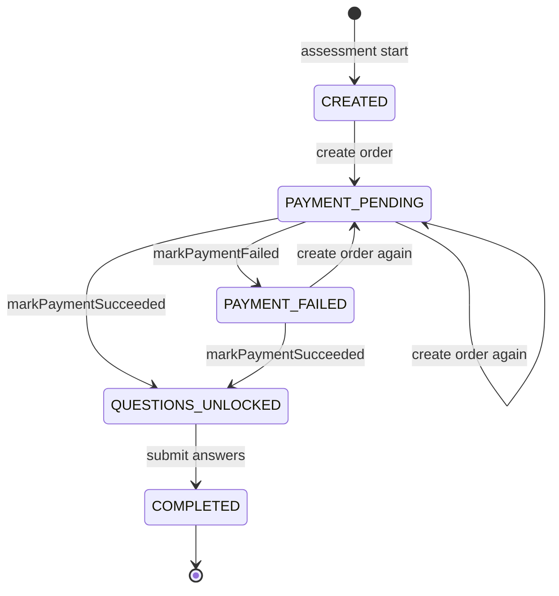
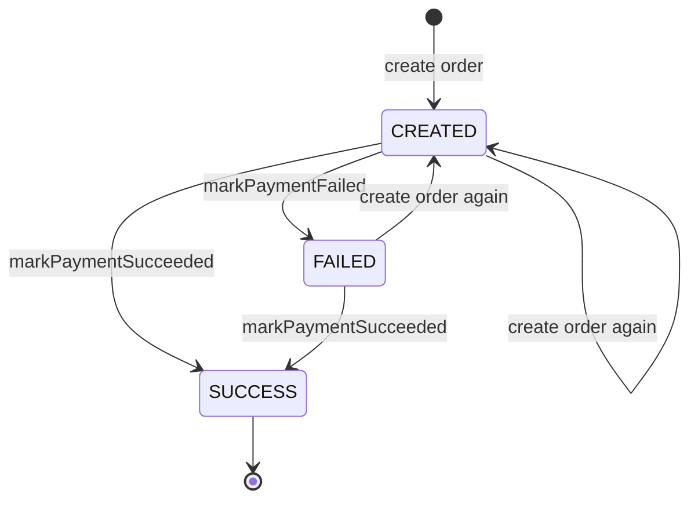

# Payments

**Audience:** developer, operator

Participants pay once per assessment through Razorpay Checkout. Payment unlocks the 50 questions.

## Contents

- [Price](#price)
- [Flow](#flow)
- [Status machines](#status-machines)
- [Confirmation paths](#confirmation-paths)
- [Guarantees](#guarantees)
- [Resume and recovery](#resume-and-recovery)
- [Razorpay setup](#razorpay-setup)
- [Testing in test mode](#testing-in-test-mode)
- [Refunds](#refunds)

## Price

The price comes from `ASSESSMENT_PRICE_PAISE` and `ASSESSMENT_CURRENCY` (see [CONFIGURATION.md](CONFIGURATION.md#pricing)). The default is ₹99 (9900 paise).

- The server sets the amount when it creates the Razorpay order. The browser never sends an amount.
- Each `Payment` row stores the `amount` and `currency` in force when its order was created.
- Revenue on the admin dashboard is the sum of stored `amount` values for `SUCCESS` payments. Changing the price does not change historical revenue.

## Flow

1. The participant submits name, email and phone on `/assessment`. `POST /api/assessment/start` creates a `Participant` and an `Assessment` (`CREATED`).
2. The page calls `POST /api/payment/create-order`. The server creates a Razorpay order for the configured price, upserts the `Payment` (`CREATED`) and sets the assessment to `PAYMENT_PENDING`.
3. The page opens Razorpay Checkout with the order ID.
4. The payment is confirmed by one or more of the [confirmation paths](#confirmation-paths). The first to arrive sets the payment to `SUCCESS` and the assessment to `QUESTIONS_UNLOCKED`.
5. The page sends the participant to `/assessment/<ASSESSMENT_ID>/questions`.

The whole sequence, with the three paths, is diagrammed in [ARCHITECTURE.md](ARCHITECTURE.md#participant-flow).

## Status machines

All payment state changes go through two functions in `src/lib/payments/unlock.ts`:

- `markPaymentSucceeded`: returns immediately if the payment is already `SUCCESS`; throws if the order ID does not match; sets the payment to `SUCCESS` with `confirmedVia`, `razorpayPaymentId` and `paidAt`; sets the assessment to `QUESTIONS_UNLOCKED` unless it is already `COMPLETED`.
- `markPaymentFailed`: does nothing if the payment is `SUCCESS`; otherwise sets the payment to `FAILED` and the assessment to `PAYMENT_FAILED`.

### Assessment.status

| Transition | Code path |
|---|---|
| none → `CREATED` | `POST /api/assessment/start` |
| `CREATED`, `PAYMENT_PENDING`, `PAYMENT_FAILED` → `PAYMENT_PENDING` | `POST /api/payment/create-order` (refused with 409 once the payment is `SUCCESS`) |
| → `QUESTIONS_UNLOCKED` | `markPaymentSucceeded`, called by client verify, the webhook (`payment.captured`, `order.paid`) and `reconcileAssessment` |
| → `PAYMENT_FAILED` | `markPaymentFailed`, called by client verify on a bad signature and by the webhook on `payment.failed` |
| `QUESTIONS_UNLOCKED` → `COMPLETED` | `POST /api/assessment/<ASSESSMENT_ID>/submit` |

Orphan cleanup deletes assessments that are still `CREATED` or `PAYMENT_FAILED` after 7 days. Reset deletes all assessments.

### Payment.status

| Transition | Code path |
|---|---|
| none → `CREATED` | `POST /api/payment/create-order` (upsert). A second order for the same assessment replaces `razorpayOrderId` and resets the status to `CREATED`. |
| `CREATED` or `FAILED` → `SUCCESS` | `markPaymentSucceeded` from client verify, webhook or reconcile |
| `CREATED` → `FAILED` | `markPaymentFailed` from client verify (bad signature) or webhook (`payment.failed`) |
| `SUCCESS` → anything | Never. `SUCCESS` is terminal. |

`PENDING` exists in the enum and is treated like `CREATED` by reconcile, resume and the dashboard counts, but no code sets it.

`FAILED` is not terminal. Reconcile skips `FAILED` payments, but a valid client verify or a later `payment.captured` webhook still moves them to `SUCCESS`.

## Confirmation paths

| Path | Trigger | Endpoint | `confirmedVia` |
|---|---|---|---|
| Client verify | Razorpay Checkout calls the page's success handler | `POST /api/payment/verify` | `client_verify` |
| Webhook | Razorpay posts an event to the server | `POST /api/payment/webhook` | `webhook` |
| Reconcile | The server asks Razorpay for the order's payments | `reconcileAssessment` in `src/lib/payments/reconcile.ts` | `reconcile` |

Reconcile runs from three places:

| Caller | When |
|---|---|
| `POST /api/payment/status` | The checkout page polls it every 3 seconds, for up to 60 seconds, if client verify fails |
| `POST /api/assessment/resume` | A participant requests a recovery email |
| `POST /api/admin/payments/reconcile` | An admin sends it JSON. The **Re-check with Razorpay** button sends a form instead and gets a 400; see [ADMIN_GUIDE.md](ADMIN_GUIDE.md#recover-a-stuck-payment). |

Reconcile looks for a payment with status `captured` on the order. If it finds one, it calls `markPaymentSucceeded`. It never marks a payment failed, because an order can have a failed attempt followed by a successful one.

Endpoint details are in [API.md](API.md).

## Guarantees

| Guarantee | How |
|---|---|
| A payment is unlocked at most once | `markPaymentSucceeded` returns early if the payment is already `SUCCESS`. Client verify also returns 200 early. Webhook events are deduplicated by event ID. |
| A successful payment is never downgraded | `markPaymentFailed` returns early on `SUCCESS`. Create-order returns 409 on `SUCCESS`. |
| A completed assessment is never re-locked | `markPaymentSucceeded` skips the assessment update when the status is `COMPLETED`. |
| The payment belongs to this assessment's order | `markPaymentSucceeded` throws if the order ID differs from the stored `razorpayOrderId`. |
| The client cannot forge a success | Client verify recomputes `HMAC-SHA256(order_id|payment_id, RAZORPAY_KEY_SECRET)` and compares it in constant time. |

**Amount and currency.** No confirmation path compares the captured amount or currency with the stored values. The protection is that the server alone sets the amount when it creates the order, and a signed or captured payment is bound to that order. The idempotency check is a read followed by a write, not a transaction, so two confirmations arriving at the same moment can both write. Both write the same end state.

## Resume and recovery

For a participant who paid but lost the page, or lost their report link:

1. The participant opens `/assessment/resume` and enters their email.
2. The page always shows the same message, whether or not the email exists.
3. For every assessment registered with that email, the server:
   - runs reconcile if the payment is `CREATED` or `PENDING`
   - if the assessment is `COMPLETED`, issues a new report link token and emails the report link
   - if the assessment is `QUESTIONS_UNLOCKED`, emails the questions link
4. Assessments in any other state get no email.

Issuing a new token makes any earlier report link for that report stop working. Both kinds of recovery email use the report email template, so a questions link arrives with the subject "Your Personality Assessment Report is Ready".

Rate limits for this endpoint are in [API.md](API.md#post-apiassessmentresume).

## Razorpay setup

### Keys

1. Sign in to the Razorpay Dashboard and choose **Test Mode** or **Live Mode** in the header.
2. Go to **Account & Settings → API Keys → Generate Key**.
3. Set `RAZORPAY_KEY_ID`, `RAZORPAY_KEY_SECRET` and `NEXT_PUBLIC_RAZORPAY_KEY_ID` (see [CONFIGURATION.md](CONFIGURATION.md#payments)). Test keys start with `rzp_test_`, live keys with `rzp_live_`.

Test mode and live mode have separate keys and separate webhooks. Repeat these steps for each mode.

### Webhook

1. Generate a secret (command in [CONFIGURATION.md](CONFIGURATION.md#generating-secrets)).
2. In the Razorpay Dashboard, go to **Account & Settings → Webhooks → Add New Webhook**.
3. Set **Webhook URL** to `https://<YOUR_DOMAIN>/api/payment/webhook`.
4. Set **Secret** to the value from step 1.
5. Select these three events, which are the only ones the app handles:
   - `payment.captured`
   - `order.paid`
   - `payment.failed`
6. Save, then set `RAZORPAY_WEBHOOK_SECRET` to the same secret and redeploy.

Other events are acknowledged with 200 and ignored.

## Testing in test mode

Use Razorpay's test cards and test UPI IDs from the Razorpay documentation. No real money moves.

| Test | Steps | Expected |
|---|---|---|
| Normal payment | Complete checkout and wait | Redirect to the questions. `confirmedVia` is `client_verify` or `webhook`, whichever arrived first. |
| Close the tab after paying | Complete payment, then close the tab before the redirect | With a webhook configured, the assessment unlocks within seconds. Without one, open `/assessment/resume`, enter the email, and the recovery email arrives with a working questions link. |
| Failed payment | Use a failing test card | Checkout shows the failure. With a webhook, the payment becomes `FAILED`. The participant can retry, which creates a new order. |
| Cancel checkout | Close the Razorpay modal | The page shows "Payment was cancelled. You can try again." Nothing changes in the database. |
| Webhook replay | Resend a delivered event from the Razorpay webhook log | 200, no second unlock |

For local development without a public URL, see [README.md](../README.md#receiving-webhooks-locally).

## Refunds

The app has no refund support.

- Refunds are made manually in the Razorpay Dashboard.
- The app does not handle any refund webhook event.
- After a refund the `Payment` row stays `SUCCESS`, the assessment stays unlocked or completed, the report link keeps working, and the amount still counts in dashboard revenue.
- To stop access after a refund, revoke the report link from the participant's page (see [ADMIN_GUIDE.md](ADMIN_GUIDE.md#report-access-panel)).
